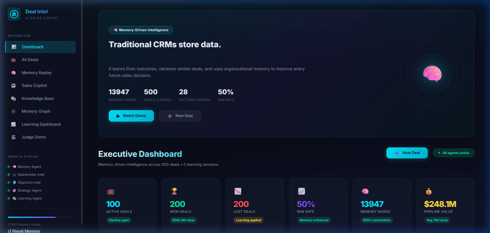
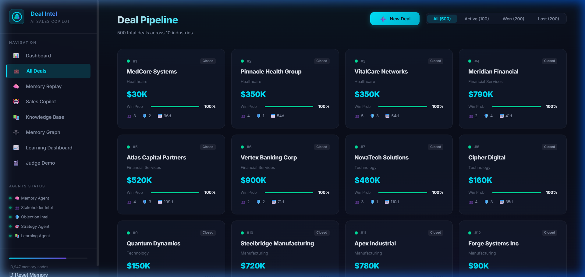
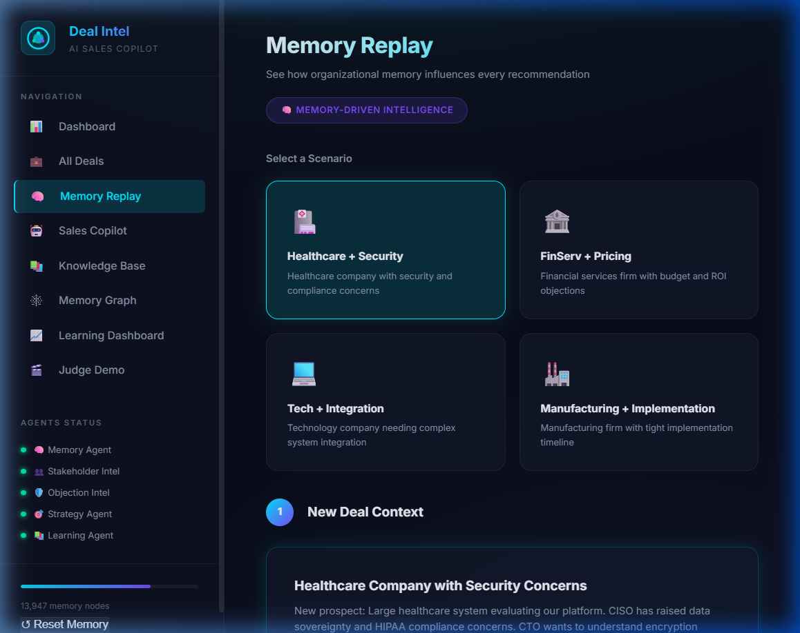
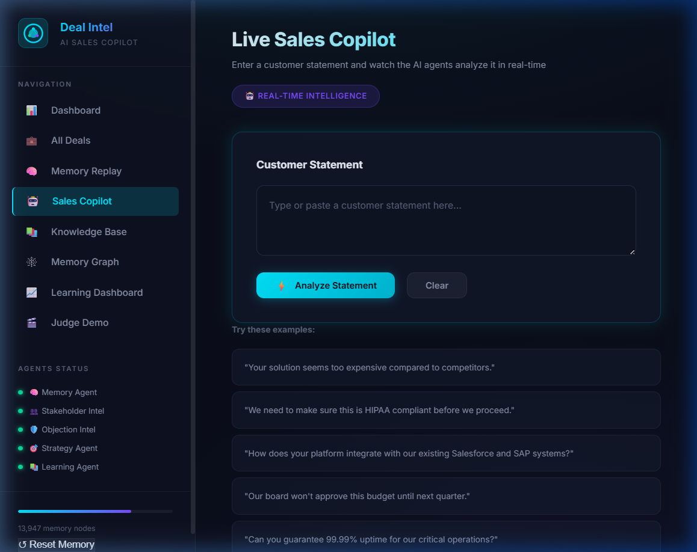
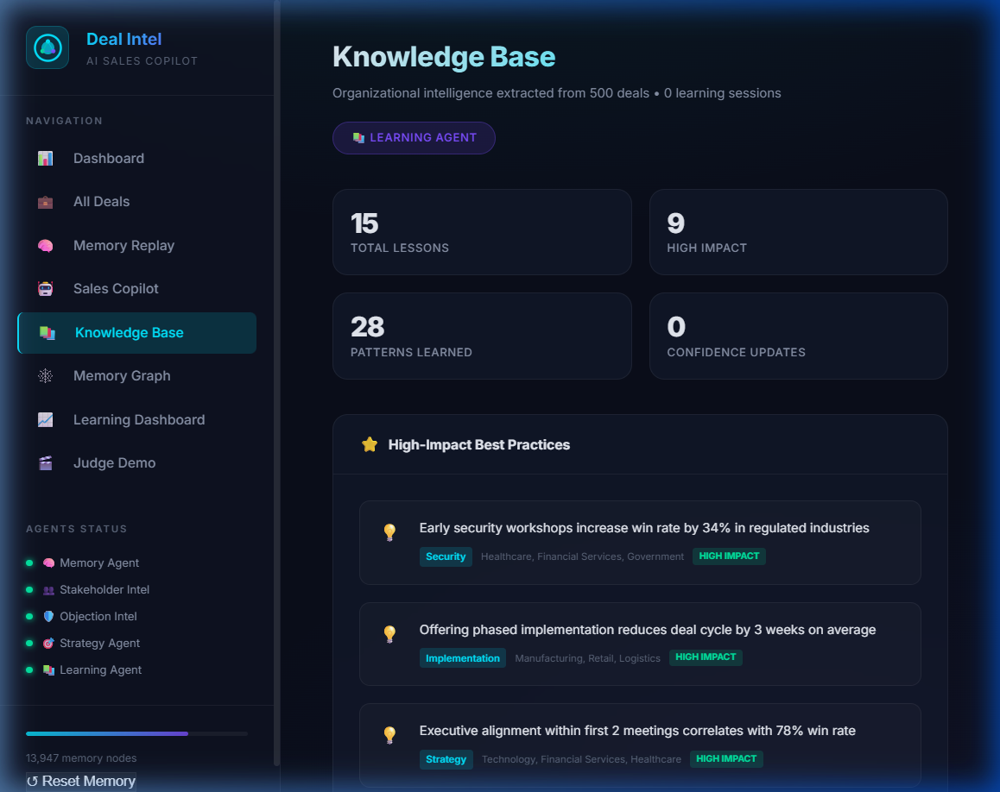
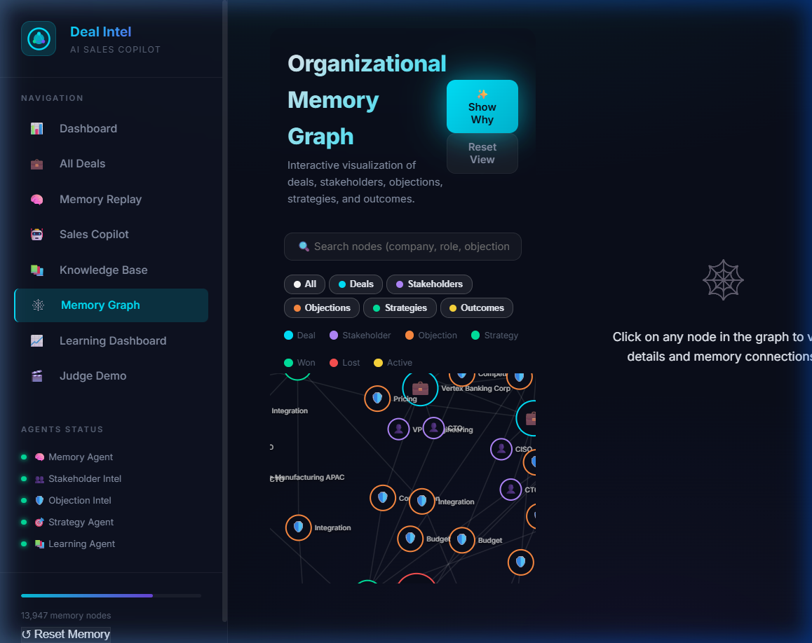
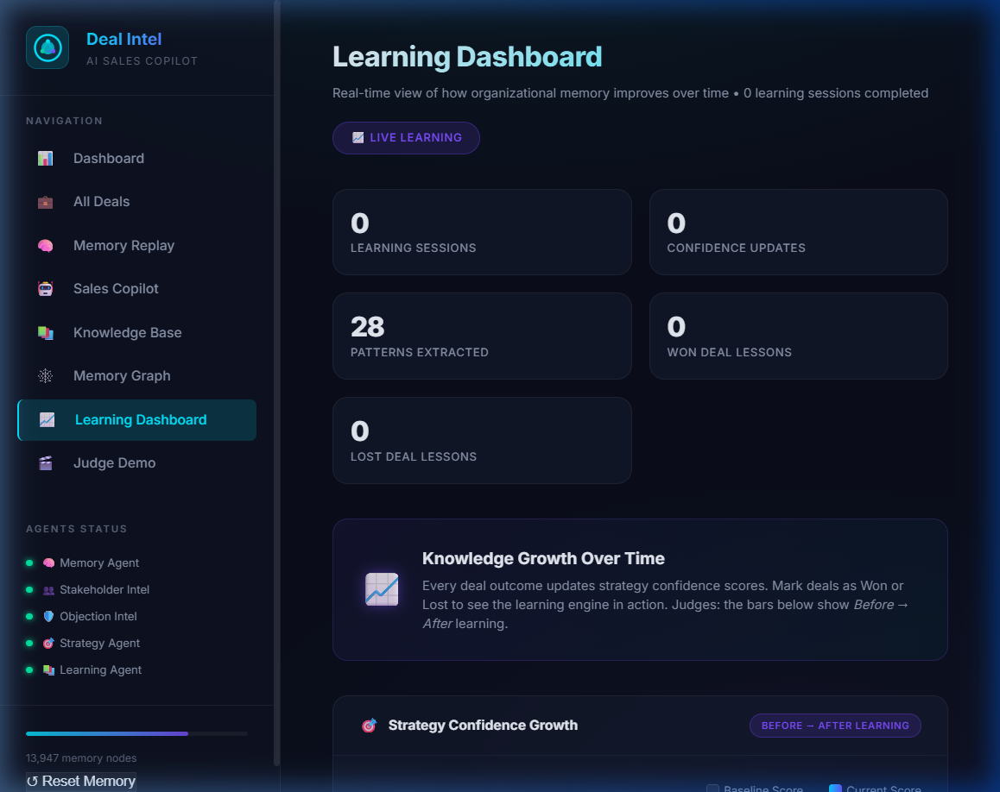
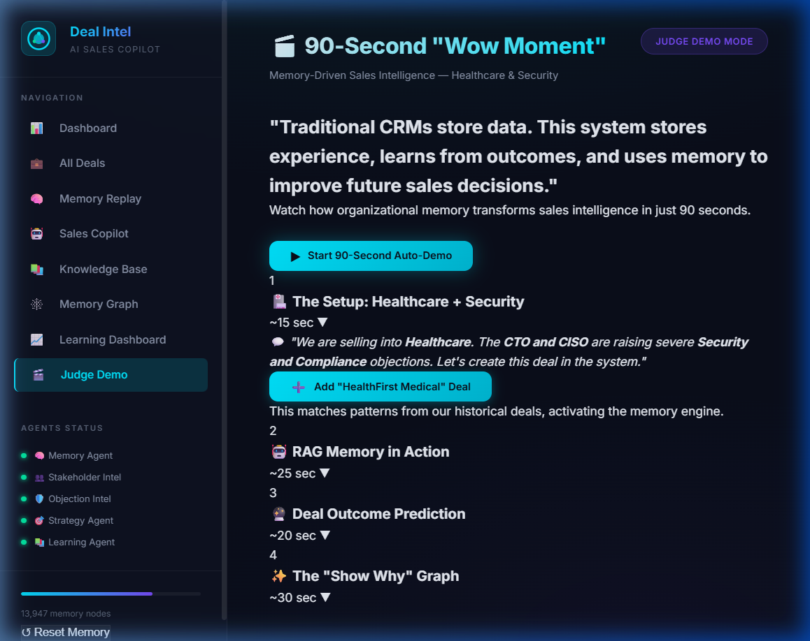

# 🧠 Deal Intelligence Agent — AI Sales Copilot with Organizational Memory

> **"Every deal teaches the system. Future recommendations become smarter because of memory."**

An AI-powered enterprise sales copilot that builds persistent organizational memory from every deal interaction, stakeholder engagement, and objection resolution — enabling teams to close deals faster by learning from the past.

---

## 📋 Problem Statement

Enterprise sales teams lose institutional knowledge when reps leave, deals are forgotten, or strategies go undocumented. This leads to:

- **Repeated mistakes** — teams encounter the same objections without knowing what worked before
- **Lost patterns** — winning strategies in specific industries are never extracted or shared
- **No organizational learning** — each deal starts from scratch instead of building on collective experience
- **Blind spots** — stakeholder dynamics, sentiment shifts, and objection trends go untracked

**Deal Intelligence Agent** solves this by creating a living, learning memory system that captures every interaction and transforms it into actionable intelligence for future deals.

---

## 🎯 Solution Overview

Deal Intelligence Agent is a **multi-agent AI system** with five specialized agents that work together:

| Agent | Role |
|-------|------|
| 🧠 **Memory Agent** | Stores, indexes, and retrieves organizational memory across all deals |
| 🕵️ **Stakeholder Intel** | Tracks sentiment, influence levels, and engagement patterns of key people |
| 🛡️ **Objection Intel** | Catalogs objections, maps resolution strategies, and predicts success rates |
| 🎯 **Strategy Agent** | Identifies winning patterns and recommends strategies based on historical data |
| 📚 **Learning Agent** | Continuously extracts lessons learned and updates the knowledge base |

The system processes **500 enterprise deals** across **10 industries**, tracking **2,500+ stakeholders**, **1,500+ objections**, and **2,800+ interactions** to demonstrate real-world pattern recognition at scale.

---

## ✨ Features Implemented

### 1. Executive Dashboard
Real-time KPIs including total pipeline value ($23.1M), win rate (50%), average deal cycle (65 days), and active deal count. Interactive charts show deal distribution by industry and stage.



### 2. Deal Management (All Deals)
Searchable, filterable grid of 500 deals with industry badges, win probability scores, deal values, and status indicators. Click any deal to see full stakeholder maps and interaction timelines.



### 3. Memory Replay
Interactive "What If" scenario engine that demonstrates how organizational memory improves deal outcomes. Select a scenario (e.g., "Healthcare HIPAA Objection") and watch the AI replay how past lessons would change the approach.



### 4. AI Sales Copilot
Natural language AI assistant that answers questions like "What's the best strategy for a healthcare deal with HIPAA concerns?" by searching organizational memory, finding similar past deals, and synthesizing actionable recommendations.



### 5. Knowledge Base
Auto-extracted organizational rules, high-impact lessons, and industry insights. Examples: "Early security workshops increase win rate by 34% in regulated industries" and "Deals with champion identification in discovery have 3.1x close rate."



### 6. Organizational Memory Graph
Interactive D3.js force-directed graph visualizing the connections between deals, stakeholders, objections, strategies, and outcomes. Features "Show Why" reasoning animation that traces the AI's decision path through the memory network.



### 7. Learning Dashboard
Live metrics showing how the system learns over time. Displays strategy confidence scores before/after learning, pattern extraction rates, and knowledge base growth metrics.



### 8. Judge Demo Mode
One-click automated 90-second demo that walks through all features sequentially — designed for hackathon judges to see the full system in action without manual navigation.



---

## 🏗️ Architecture

```
┌─────────────────────────────────────────────────────────────────┐
│                        FRONTEND (Vanilla JS)                     │
│  ┌──────────┐ ┌──────────┐ ┌──────────┐ ┌──────────┐           │
│  │Dashboard │ │All Deals │ │ Copilot  │ │  Memory  │           │
│  │   View   │ │   Grid   │ │   Chat   │ │  Graph   │           │
│  └──────────┘ └──────────┘ └──────────┘ └──────────┘           │
│  ┌──────────┐ ┌──────────┐ ┌──────────┐ ┌──────────┐           │
│  │Knowledge │ │ Memory   │ │Learning  │ │  Judge   │           │
│  │  Base    │ │ Replay   │ │Dashboard │ │  Demo    │           │
│  └──────────┘ └──────────┘ └──────────┘ └──────────┘           │
├─────────────────────────────────────────────────────────────────┤
│                    MULTI-AGENT SYSTEM (JS)                        │
│  ┌──────────┐ ┌──────────┐ ┌──────────┐ ┌──────────┐           │
│  │ Memory   │ │Stakeholder│ │Objection │ │Strategy  │           │
│  │ Agent    │ │  Intel   │ │  Intel   │ │  Agent   │           │
│  └──────────┘ └──────────┘ └──────────┘ └──────────┘           │
│               ┌──────────┐                                       │
│               │Learning  │                                       │
│               │  Agent   │                                       │
│               └──────────┘                                       │
├─────────────────────────────────────────────────────────────────┤
│                      BACKEND (Node.js / Express)                 │
│  ┌──────────┐ ┌──────────┐ ┌──────────────────────┐            │
│  │REST API  │ │Supabase  │ │  Data Seeder (500    │            │
│  │ Routes   │ │ Client   │ │  deals, procedural)  │            │
│  └──────────┘ └──────────┘ └──────────────────────┘            │
├─────────────────────────────────────────────────────────────────┤
│                      DATABASE (Supabase / PostgreSQL)            │
│  ┌─────┐ ┌────────────┐ ┌──────────┐ ┌────────────┐           │
│  │Deals│ │Stakeholders│ │Objections│ │Interactions│           │
│  └─────┘ └────────────┘ └──────────┘ └────────────┘           │
│               ┌──────────────┐                                   │
│               │ System State │                                   │
│               └──────────────┘                                   │
└─────────────────────────────────────────────────────────────────┘
```

---

## 🛠️ Technology Stack

| Layer | Technology | Purpose |
|-------|-----------|---------|
| **Frontend** | HTML5, CSS3, Vanilla JavaScript | Single-page application with custom routing |
| **Visualization** | D3.js v7 | Force-directed memory graph, interactive animations |
| **Styling** | Custom CSS with CSS Variables | Dark mode, glassmorphism, micro-animations |
| **Backend** | Node.js, Express 5 | REST API server |
| **Database** | Supabase (PostgreSQL) | Persistent storage with Row Level Security |
| **ORM/Client** | @supabase/supabase-js v2 | Database operations with snake_case → camelCase mapping |
| **Deployment** | Vercel | Serverless deployment with Edge functions |
| **Version Control** | Git + GitHub | Source code management |

---

## 🚀 Setup Instructions

### Prerequisites
- Node.js v18+ installed
- A Supabase account (free tier works)

### 1. Clone the Repository

```bash
git clone https://github.com/DharmChaniyara/CODE-BUSTERS-.git
cd CODE-BUSTERS-
```

### 2. Install Dependencies

```bash
npm install
```

### 3. Configure Environment

Create a `.env` file in the project root:

```env
SUPABASE_URL=your_supabase_project_url
SUPABASE_SERVICE_KEY=your_supabase_service_role_key
```

### 4. Set Up Database

Run the SQL migration in the Supabase Dashboard → SQL Editor:

```bash
# Copy and paste the contents of backend/supabase_migration.sql
# into the Supabase SQL Editor and execute
```

### 5. Run Locally

```bash
# Start the backend server
npm start

# OR serve the frontend directly (for frontend-only demo)
npx serve frontend -l 3000
```

### 6. Open in Browser

Navigate to `http://localhost:3000`

---

## 📁 Project Structure

```
CODE-BUSTERS-/
├── frontend/
│   ├── index.html              # Entry point with SEO meta tags
│   ├── css/
│   │   ├── styles.css          # Main stylesheet (90KB+ with animations)
│   │   └── graph.css           # Memory graph-specific styles
│   └── js/
│       ├── data.js             # Procedural data generation (500 deals, seeded)
│       ├── memory.js           # Persistent memory store + IndexedDB
│       ├── agents.js           # Multi-agent system (5 AI agents)
│       ├── ai.js               # AI reasoning engine + NLP
│       ├── graph.js            # D3.js organizational memory graph
│       └── app.js              # Main SPA controller (2,950 lines)
├── backend/
│   ├── server.js               # Express API server with Supabase integration
│   ├── supabase_migration.sql  # Database schema (5 tables + RLS policies)
│   └── api/
│       └── db.js               # Supabase client initialization
├── docs/
│   └── screenshots/            # Application screenshots
├── package.json                # Dependencies and scripts
├── vercel.json                 # Deployment configuration
├── .env                        # Environment variables (not committed)
└── .gitignore                  # Git ignore rules
```

---

## 📊 Database Schema

| Table | Description | Key Fields |
|-------|-------------|------------|
| `deals` | 500 enterprise deals across 10 industries | company, industry, value, stage, status, win_probability, key_factors |
| `stakeholders` | 2,500+ decision makers and influencers | name, role, influence_level, concerns, sentiment, engagement_score |
| `objections` | 1,500+ sales objections with resolutions | category, description, resolution, outcome, historical_success_rate |
| `interactions` | 2,800+ meeting notes and call logs | type, content, stakeholder_name, sentiment, key_topics |
| `system_state` | Learning state and knowledge base (JSONB) | knowledge_base, memory_stats, learning_state |

---

## 🔑 Key Differentiators

1. **Organizational Memory** — Unlike CRMs that store data passively, our system actively learns from every deal and builds institutional knowledge
2. **Multi-Agent Architecture** — Five specialized AI agents collaborate to provide holistic deal intelligence
3. **Reasoning Transparency** — "Show Why" animation traces exactly how the AI arrives at recommendations through the memory graph
4. **Scale** — Demonstrates pattern recognition across 500 deals, 10 industries, and 13,947 memory nodes
5. **Real-time Learning** — The Learning Dashboard shows live strategy confidence scores evolving over time

---

## 👥 Team: CODE BUSTERS

| Member | Role |
|--------|------|
| Dharam Chaniyara | Team Lead / Full Stack Developer |
| *(Add other team members here)* | *(Add roles)* |

---

## 📄 License

This project was built for a hackathon and is provided as-is for evaluation purposes.
